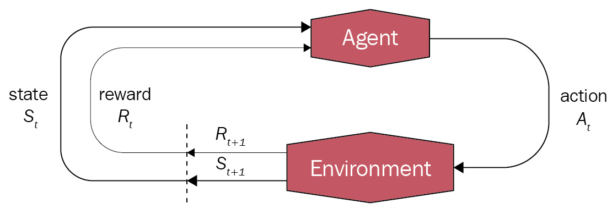
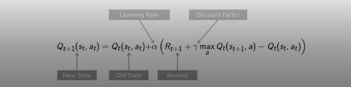

# Implementation de l'algorithme Q-learning 
## Principe de Q-learning

- Apprentissage par renforcement. 
- Il permet à un agent  d'apprendre à prendre des décisions en interagissant avec un environnement.



- Les notions importantes dans le cadre du Q-learning sont les suivantes :
  1. Environnement : C'est le contexte dans lequel l'agent évolue et interagit. Il peut s'agir d'un environnement physique, virtuel ou théorique, où l'agent peut percevoir des états, effectuer des actions et recevoir des récompenses. 
  2. Agent : C'est l'entité qui prend des décisions et agit dans l'environnement. L'agent utilise la fonction Q pour guider ses actions. Il perçoit l'état actuel, choisit une action et interagit avec l'environnement en effectuant cette action. 
  3. État (State) : L'état représente le contexte dans lequel se trouve l'agent à un instant donné. Il contient les informations pertinentes pour prendre une décision. L'état peut inclure des données sur la position de l'agent, les conditions environnementales, les informations sensorielles, etc. Après chaque action, l'agent change d'état. 
  4. Récompense (Reward) : La récompense est un signal numérique qui évalue la qualité de la décision ou de l'action prise par l'agent dans un état donné. Elle peut être positive, négative ou neutre. La récompense est utilisée pour guider l'apprentissage de l'agent, car l'objectif est de maximiser les récompenses cumulatives à long terme. 
  5. Action : Les actions sont les décisions définies à l'avance que l'agent peut prendre dans un environnement donné. Elles représentent les choix disponibles à chaque étape. Les actions peuvent être discrètes (par exemple, déplacer vers le haut, vers le bas, à gauche ou à droite) ou continues (par exemple, contrôler la vitesse ou l'angle).
## Fonctionnement de Q-learning

Le Principe de fonctionnement de l'algorithme  Q-learning peut être décrit en plusieurs étapes :

1. ```Etat et action``` : L'environnement est divisé en états, et à chaque état, l'agent peut choisir parmi plusieurs actions possibles.

2. ```Tableau de valeurs Q``` : L'algorithme Q-learning utilise un tableau de valeurs Q (Q-table) pour stocker les valeurs d'utilité (Q-valeurs) associées à chaque paire état-action.

3. ```Exploration et exploitation``` : Lors de l'apprentissage, l'agent alterne entre l'exploration de nouvelles actions et l'exploitation des connaissances accumulées. L'exploration permet de découvrir de nouvelles actions potentiellement meilleures, tandis que l'exploitation consiste à choisir les actions ayant les valeurs Q les plus élevées.

4. ```Mise à jour de la fonction Q``` :  L'agent met à jour les valeurs Q en utilisant la formule de mise à jour du Q-learning basée sur l'équation de Bellman.

   

    Avec : 
      - Q(St, At) est la valeur de la fonction Q pour l'état St et l'action At. 
      - α (alpha) est le taux d'apprentissage, qui contrôle l'influence de la mise à jour sur la fonction Q existante.
      - Rt est la récompense observée après avoir effectué l'action At dans l'état St.
      - γ (gamma) est le facteur d'actualisation, qui pondère l'importance des récompenses futures par rapport aux récompenses immédiates.
      - max(Q(St+1, a)) représente la valeur maximale de la fonction Q pour l'état suivant St+1 et toutes les actions possibles a.

    La mise à jour de la fonction Q se base sur l'erreur de prédiction entre la valeur actuelle Q(St, At) et l'estimation de la récompense attendue Rt + γ * max(Q(St+1, a)). 
   
    En utilisant cette formule, l'agent ajuste progressivement les valeurs Q pour chaque paire état-action en fonction des récompenses observées et des estimations des récompenses futures. Cette mise à jour itérative permet à l'agent d'apprendre à prendre des décisions optimales dans l'environnement donné.


_L'algorithme Q-learning est largement utilisé dans l'apprentissage par renforcement pour résoudre des problèmes où l'agent interagit avec un environnement dynamique et apprend à optimiser ses actions en fonction des récompenses reçues_.


## Réalisation
  - [Q-learning Sequentielle](https://github.com/sokainadaabal/SMA_IA/tree/main/QLearningSMA/src/ma/enset/ImpSequentiel)
  - [Q-learning implentetation avec systeme multiAgents](https://github.com/sokainadaabal/SMA_IA/tree/main/QLearningSMA/src/ma/enset/ImpSma)
