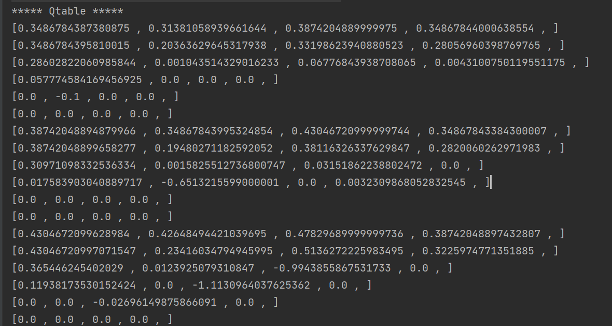
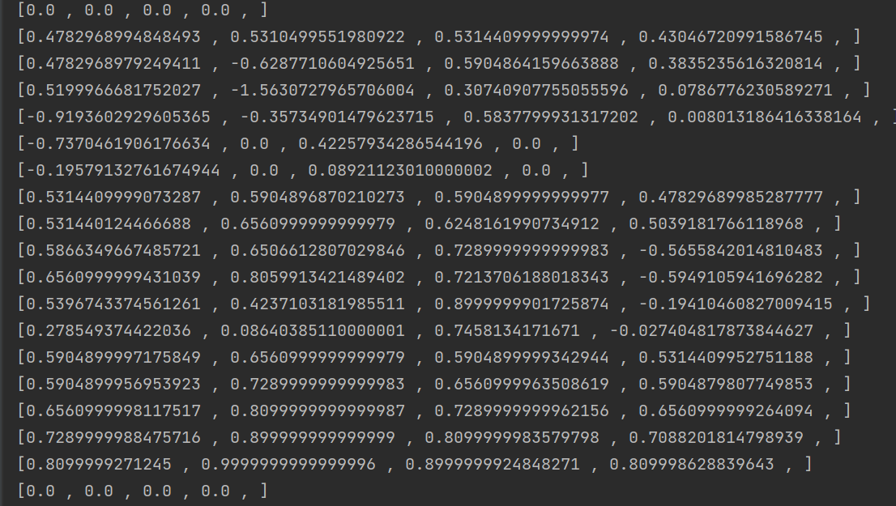
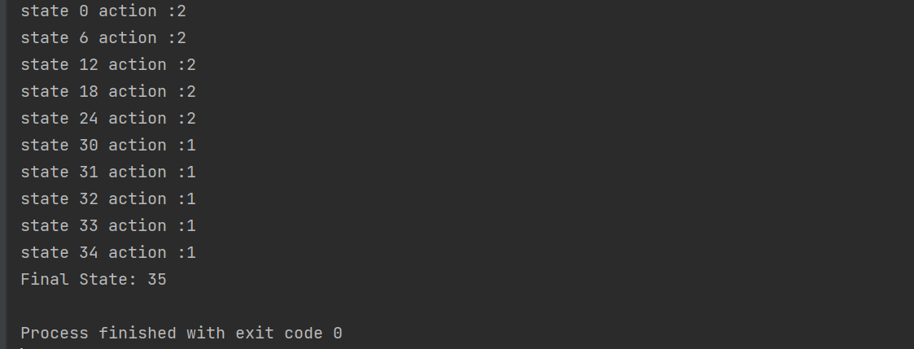

# Q-Learning Implementation Sequentiel
## Problem 

Le défi consiste à naviguer à travers un labyrinthe pour trouver la sortie, en commençant à la case (0,0) et en se déplaçant dans les quatre directions possibles : haut, bas, gauche et droite.

Le labyrinthe est une grille de 6x6 cases, numérotées de 0 à 35 de gauche à droite et de haut en bas. Dans cette grille, certaines cases sont des obstacles, indiqués par le chiffre -1, tandis que d'autres sont des chemins accessibles, indiqués par le chiffre 0. La case finale, où l'agent doit arriver, est marquée par le chiffre 1.

Voici la représentation de la grille de départ :

```
+---+---+---+---+---+---+
| 0 | 1 | 2 | 3 | 4 | 5 |
+---+---+---+---+---+---+
| 6 | 7 | 8 | 9 |10 |11 |
+---+---+---+---+---+---+
|12 |13 |14 |15 |16 |17 |
+---+---+---+---+---+---+
|18 |19 |-1 |-1 |22 |23 |
+---+---+---+---+---+---+
|24 |25 |26 |-1 |28 |29 |
+---+---+---+---+---+---+
|30 |31 |-1 |33 |34 |35 |
+---+---+---+---+---+---+
```

L'agent reçoit une récompense de 1 s'il atteint la case finale (35) et une récompense de -1 s'il atteint une case qui n'est pas la case finale.

L'objectif est que chaque agent apprenne à trouver le chemin le plus court pour atteindre la case finale à partir de sa position de départ en utilisant l'algorithme de Q-Learning.

## Implementation

### ```QLUtils```
Cette classe contient des constantes qui peuvent être utilisées dans l'implémentation du Q-learning.
- ```ALPHA``` : Taux d'apprentissage (valeur entre 0 et 1) qui contrôle l'influence de la mise à jour sur la fonction Q existante.
- ```GAMMA``` : Facteur d'actualisation (valeur entre 0 et 1) qui pondère l'importance des récompenses futures par rapport aux récompenses immédiates.
- ```EPS``` : Paramètre epsilon (valeur entre 0 et 1) utilisé pour l'exploration et l'exploitation lors du choix des actions.
- ```MAX_EPOCH``` : Nombre maximum d'épisodes (itérations) d'apprentissage.
- ```GRID_SIZE``` : Taille de la grille (nombre de lignes et de colonnes).
- ```ACTION_SIZE``` : Nombre d'actions possibles pour chaque agent.
- ```actions``` : Tableau représentant les différentes actions possibles. Chaque action est représentée par un déplacement en x et en y.
- ```AGENTS_NUMBER``` : Nombre d'agents présents dans l'environnement.
- ```GRID``` : Grille représentant les récompenses. Chaque case de la grille contient une valeur représentant la récompense associée à cette case.
  Ces constantes peuvent être utilisées dans votre implémentation du Q-learning pour faciliter l'ajustement des paramètres et la configuration de votre environnement spécifique.
```java
public class QLUtils {
    public static final double ALPHA=0.1;
    public static final double GAMMA = 0.9;
    public static final double EPS = 0.3; // epsilon
    public static final int MAX_EPOCH=2000;
    public static final int GRID_SIZE=6;
    public static final int Action_SIZE=4;
    public  static final int[][]  actions=new int [][]{
            {0,-1}, // gauche
            {0,1}, // droite
            {1,0}, // bas
            {-1,0}  // haut
    };
   public static final int AGENTS_NUMBER = 3;
   public static final int [][] GRID ={
           {0,0,0,0,0,-1},
           {0,0,0,0,-1,0},
           {0,0,0,0,0,0},
           {0,0,-1,-1,0,0},
           {0,0,0,-1,0,0},
           {0,0,-1,0,0,1}
   }; // presente les recompense
}
```

### ```QLearning```
La classe ```QLearning``` contient une table Q (qTable) pour stocker les valeurs Q pour chaque état-action.
- La méthode ```chooseAction(eps)``` est utilisée pour sélectionner une action à effectuer. Elle utilise un paramètre epsilon (eps) pour déterminer s'il faut effectuer une exploration ou une exploitation. Lors de l'exploration, une action aléatoire est choisie. Lors de l'exploitation, l'action avec la meilleure valeur Q pour l'état actuel est choisie. 
- La méthode ```executeAction(act)``` est utilisée pour exécuter une action donnée. Elle met à jour les coordonnées de l'agent (stateX et stateY) en fonction de l'action choisie. 
- La méthode ```resetState()``` réinitialise l'état de l'agent au point de départ (0,0) du labyrinthe. 
- La méthode ```runQLearning()``` exécute l'algorithme Q-Learning. Elle effectue des itérations jusqu'à ce qu'une condition de fin soit atteinte. À chaque itération, l'agent se déplace dans le labyrinthe en choisissant des actions et met à jour les valeurs Q en fonction des récompenses reçues. 
- La méthode ```showResult()``` affiche la table Q résultante après l'apprentissage. Elle réinitialise ensuite l'état de l'agent et le fait se déplacer dans le labyrinthe en choisissant les actions avec les valeurs Q maximales. 
- La méthode ```finished()``` vérifie si l'agent a atteint l'état final du labyrinthe, où la récompense est positive (1).
Notez que le code utilise la classe QLUtils pour accéder à certaines constantes, telles que la taille de la grille du labyrinthe, les actions possibles et les paramètres d'apprentissage (EPS, ALPHA, GAMMA, MAX_EPOCH).

Cette implémentation du Q-Learning séquentiel vise à permettre à l'agent d'apprendre à trouver le chemin optimal pour atteindre la sortie du labyrinthe à partir de sa position de départ en utilisant l'exploration et l'exploitation.
### ```Test```
la classe Test permet de tester et exécuter l'algorithme Q-Learning sur le problème du labyrinthe
```java
public class Test {
    public static void main(String[] args) {
        QLearning qLearning= new QLearning();
        qLearning.runQLearning();
    }
}
```
## Resultat






