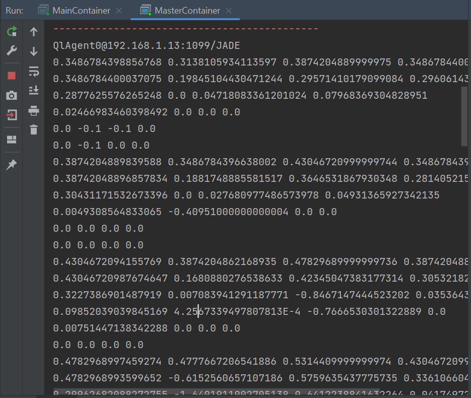

# SMA

## Le principe de mon Implementation 
Dans cette implémentation, nous utilisons un agent distinct pour chaque case de la grille. Chaque agent a les mêmes actions possibles et la même grille à résoudre, mais ils peuvent avoir des points de départ différents. L'objectif de chaque agent est de trouver le chemin le plus court pour aller de sa case de départ à la case d'arrivée.

Une fois qu'un agent a trouvé le chemin optimal, il renvoie ce chemin à un agent central chargé de l'affichage de la table de Q-valeurs de l'agent. Cette table de Q-valeurs est mise à jour au fur et à mesure que l'agent apprend à résoudre la grille en utilisant l'algorithme Q-learning.

En résumé, chaque agent travaille de manière indépendante pour trouver le chemin le plus court vers la case d'arrivée. Lorsqu'un agent réussit, il communique son chemin au responsable de l'affichage. Cela permet à l'agent central d'afficher la table de Q-valeurs spécifique à cet agent, montrant les valeurs apprises pour chaque état-action.

## Implémentation

- ```QLUtils```
  Cette classe contient des constantes qui peuvent être utilisées dans l'implémentation du Q-learning.
  - ```ALPHA``` : Taux d'apprentissage (valeur entre 0 et 1) qui contrôle l'influence de la mise à jour sur la fonction Q existante. 
  - ```GAMMA``` : Facteur d'actualisation (valeur entre 0 et 1) qui pondère l'importance des récompenses futures par rapport aux récompenses immédiates.
  - ```EPS``` : Paramètre epsilon (valeur entre 0 et 1) utilisé pour l'exploration et l'exploitation lors du choix des actions.
  - ```MAX_EPOCH``` : Nombre maximum d'épisodes (itérations) d'apprentissage. 
  - ```GRID_SIZE``` : Taille de la grille (nombre de lignes et de colonnes). 
  - ```ACTION_SIZE``` : Nombre d'actions possibles pour chaque agent. 
  - ```actions``` : Tableau représentant les différentes actions possibles. Chaque action est représentée par un déplacement en x et en y. 
  - ```AGENTS_NUMBER``` : Nombre d'agents présents dans l'environnement. 
  - ```GRID``` : Grille représentant les récompenses. Chaque case de la grille contient une valeur représentant la récompense associée à cette case.
Ces constantes peuvent être utilisées dans votre implémentation du Q-learning pour faciliter l'ajustement des paramètres et la configuration de votre environnement spécifique.
```java
public class QLUtils {
    public static final double ALPHA=0.1;
    public static final double GAMMA = 0.9;
    public static final double EPS = 0.3; // epsilon
    public static final int MAX_EPOCH=2000;
    public static final int GRID_SIZE=6;
    public static final int Action_SIZE=4;
    public  static final int[][]  actions=new int [][]{
            {0,-1}, // gauche
            {0,1}, // droite
            {1,0}, // bas
            {-1,0}  // haut
    };
   public static final int AGENTS_NUMBER = 3;
   public static final int [][] GRID ={
           {0,0,0,0,0,-1},
           {0,0,0,0,-1,0},
           {0,0,0,0,0,0},
           {0,0,-1,-1,0,0},
           {0,0,0,-1,0,0},
           {0,0,-1,0,0,1}
   }; // presente les recompense
}
```
- Agent : ```QAgent ```
  La classe "QLAgent" est un agent spécifique qui implémente le Q-learning. Elle contient les méthodes nécessaires pour initialiser l'agent, choisir et exécuter des actions, exécuter l'algorithme Q-learning, afficher la Q-table et envoyer la Q-table à l'agent central.
  1. ``` setup() ``` : Cette méthode initialise l'agent et définit son comportement séquentiel. Elle est appelée lors du démarrage de l'agent. Elle affiche un message de bienvenue et ajoute les sous-comportements nécessaires à l'exécution de l'algorithme Q-learning. 
  2. ``` chooseAction(double eps) ``` : Cette méthode est utilisée pour choisir une action à exécuter par l'agent. Elle prend en paramètre un epsilon (eps) qui contrôle l'exploration et l'exploitation. Si un nombre aléatoire est inférieur à eps, l'agent effectue une exploration en choisissant une action aléatoire parmi les actions possibles. Sinon, il effectue une exploitation en choisissant l'action avec la valeur Q maximale pour l'état actuel. 
  3. ``` executeAction(int act)``` : Cette méthode est utilisée pour exécuter une action choisie par l'agent. Elle prend en paramètre l'indice de l'action à exécuter. Elle met à jour les coordonnées de l'état de l'agent en fonction de l'action choisie et renvoie l'indice de l'état résultant. 
  4. ``` resetState() ``` : Cette méthode réinitialise l'état de l'agent en fonction des coordonnées de départ passées en argument lors de la création de l'agent. 
  5. ``` runQLearning() ``` : Cette méthode contient la boucle principale de l'algorithme Q-learning. Elle itère jusqu'à ce qu'un certain nombre maximal d'épisodes (MAX_EPOCH) soit atteint ou que l'agent atteigne l'état final. À chaque itération, elle choisit une action, exécute l'action, met à jour les valeurs Q et vérifie si l'état final est atteint. À la fin de l'exécution, elle affiche la Q-table et effectue une démonstration de l'agent. 
  6. ``` showResult() ``` : Cette méthode est utilisée pour afficher la Q-table. Elle parcourt la Q-table et affiche les valeurs Q correspondantes pour chaque état-action. 
  7. ``` finished()``` : Cette méthode vérifie si l'agent a atteint l'état final. Elle renvoie true si l'état actuel de l'agent correspond à l'état final défini dans la grille. 
  8. ``` EnvoyerQTable() ``` : Cette méthode est utilisée pour envoyer la Q-table à l'agent central. Elle recherche l'agent central dans le répertoire des services, crée un message ACL INFORM contenant les valeurs de la Q-table, et envoie le message à l'agent central. 
  9. ``` takeDown() ``` : Cette méthode est appelée lors de l'arrêt de l'agent. Elle permet de se désenregistrer du répertoire des services.
- Master Agent : ```MasterAgent```
  La classe MasterAgent représente l'agent central chargé de recevoir la Q-table des agents individuels et de l'afficher
  1. ``` setup() ``` : Cette méthode est appelée lors du démarrage de l'agent. Elle enregistre l'agent central dans le répertoire des services en spécifiant son nom et le type de service ("QLearningAgent"). Ensuite, elle ajoute un comportement cyclique qui permet à l'agent central de recevoir les messages contenant les Q-tables des agents individuels. 
  2. ``` action() ``` : Cette méthode est exécutée de manière cyclique par l'agent central. Elle reçoit les messages ACL et extrait la Q-table envoyée par l'agent individuel. La Q-table est convertie en un tableau qTable de type double[][]. Ensuite, la Q-table est affichée ligne par ligne.
  Cela permet à l'agent central de recevoir les Q-tables de chaque agent individuel et de les afficher. Ainsi, l'agent central peut observer les connaissances accumulées par les agents et analyser les performances de l'algorithme Q-learning dans la résolution de la grille.
```java
public class MasterAgent extends Agent {
    @Override
    protected void setup() {
        DFAgentDescription dfd=new DFAgentDescription();
        dfd.setName(getAID());
        ServiceDescription sd = new ServiceDescription();
        sd.setType("QLearningAgent");
        sd.setName("masterAgent");
        dfd.addServices(sd);
        try{
            DFService.register(this,dfd);
        }catch(FIPAException e){
                throw new RuntimeException(e);
        }
        addBehaviour(new CyclicBehaviour() {
            @Override
            public void action() {
                ACLMessage recivedMessage = receive();
                double[][] qTable= new double[QLUtils.GRID_SIZE*QLUtils.GRID_SIZE][QLUtils.Action_SIZE];
                if(recivedMessage!=null){
                    // recoit le table Q-table de l'apart de agent
                    System.out.println(recivedMessage.getSender().getName());
                    String qTString= recivedMessage.getContent();
                    String[] rows= qTString.split("\n");
                    // supprimer la ligne null de table
                    rows[0]=rows[0].substring(4);
                    for (int i=0;i<rows.length;i++){
                        String[] columns=rows[i].split(",");
                        for (int j=0;j<columns.length;j++){
                            qTable[i][j]=Double.parseDouble(columns[j]);
                        }
                    }
                    // Afficher Q-Table
                    for (int i=0;i<QLUtils.GRID_SIZE*QLUtils.GRID_SIZE;i++) {
                        for (int j = 0; j < QLUtils.Action_SIZE; j++) {
                            System.out.print(qTable[i][j] + " ");
                        }
                        System.out.println();
                    }

                }
                else {
                    block();
                }
            }
        });
    }
}
```
- Test
  - ```masterContainer```
    Cette classe permet de démarrer le conteneur d'agents et de créer l'agent central qui sera chargé de recevoir les Q-tables des agents individuels. 
```java
public class MasterContainer {
    public static void main(String[] args) throws StaleProxyException {
       Runtime runtime = Runtime.instance();
        ProfileImpl profile = new ProfileImpl();
        profile.setParameter(ProfileImpl.MAIN_HOST, "localhost");
        AgentContainer agentContainer = runtime.createAgentContainer(profile);
        agentContainer.createNewAgent("masterAgent", MasterAgent.class.getName(), new Object[]{}).start();

    }
}
```
   - ```SimpleContainer```
     Cette classe permet de démarrer le conteneur d'agents et de créer les agents individuels qui vont apprendre à résoudre la grille et envoyer leurs Q-tables à l'agent central.
``` java
public class SimpleContainer {
    public static void main(String[] args) throws StaleProxyException {
        Runtime runtime = Runtime.instance();
        ProfileImpl profile=new ProfileImpl();
        profile.setParameter(ProfileImpl.MAIN_HOST,"localhost");
        AgentContainer agentContainer = runtime.createAgentContainer(profile);
        for (int i=0;i< QLUtils.AGENTS_NUMBER;i++){
            try{
                AgentController serverAgent= agentContainer.createNewAgent("QlAgent"+ i, QLAgent.class.getName(),new Object[]{0,i});
                serverAgent.start();
            }catch (Exception e){
                e.printStackTrace();
            }
        }
    }
}
```
- Maincontainer
  La classe MainContainer est responsable du démarrage du conteneur principal de l'environnement d'exécution JADE
```java
public class MainContainer {
    public static void main(String[] args) throws ControllerException {
        Runtime runtime = Runtime.instance();
        ProfileImpl profile=new ProfileImpl();
        profile.setParameter(Profile.GUI,"true");
        AgentContainer mainContainer= runtime.createMainContainer(profile);
        mainContainer.start();
    }
}
```

## Résulat 

### MainContainer

### MasterContainer
```commandline
QlAgent0@192.168.1.13:1099/JADE
0.3486784398856768 0.3138105934113597 0.3874204889999975 0.34867844009052534 
0.3486784400037075 0.19845104430471244 0.29571410179099084 0.296061433897409 
0.2877625576265248 0.0 0.04718083361201024 0.07968369304828951 
0.02466983460398492 0.0 0.0 0.0 
0.0 -0.1 -0.1 0.0 
0.0 -0.1 0.0 0.0 
0.3874204889839588 0.3486784396638002 0.43046720999999744 0.3486784399488721 
0.38742048896857834 0.1881748885581517 0.3646531867930348 0.28140521599634444 
0.30431171532673396 0.0 0.027680977486573978 0.04931365927342135 
0.0049308564833065 -0.40951000000000004 0.0 0.0 
0.0 0.0 0.0 0.0 
0.0 0.0 0.0 0.0 
0.4304672094155769 0.3874204862168935 0.47829689999999736 0.38742048889443487 
0.43046720987674647 0.1680880276538633 0.42345047383177314 0.3053218243343989 
0.3227386901487919 0.007083941291187771 -0.8467147444523202 0.03536430944039888 
0.09852039039845169 4.2567339497807813E-4 -0.7666530301322889 0.0 
0.00751447138342288 0.0 0.0 0.0 
0.0 0.0 0.0 0.0 
0.4782968997459274 0.4777667206541886 0.5314409999999974 0.43046720994017407 
0.4782968993599652 -0.6152560657107186 0.5759635437775735 0.3361066042848413 
0.20962682088272755 -1.6401911002705138 0.6412238841632264 0.041749729929788995 
-0.8930482268514526 -0.08880413467783807 0.6332882466574894 0.005182802198491185 
-0.860964869738744 0.0 0.33168832280267535 1.4719669550032136E-4 
-0.14967684874628723 0.0 0.0 0.0 
0.5314409837117067 0.590489998636889 0.5904899999999977 0.47829689780790596 
0.5217281395004068 0.6316992087913935 0.6560999999999979 0.4588210499765313 
0.5588088836656977 0.6489314700246531 0.7289999999784766 -0.4998653731662826 
0.4541863142727828 0.668184085102373 0.8099999995337646 -0.6624854501381533 
0.44181250830775554 0.32147159367410005 0.8999999972074647 -0.10637819430944674 
0.6294444618810356 0.0 0.19 -0.006190818167066319 
0.5904899986720096 0.6560999999999979 0.5904899998377371 0.531440999793001 
0.5904899998061435 0.7289999999999983 0.6560999985384461 0.5904899999332712 
0.6560999999926861 0.8099999999999987 0.7289999999617445 0.6560999994478592 
0.7289999999746077 0.899999999999999 0.8099999998991836 0.7289999870040448 
0.8099999927860756 0.9999999999999996 0.8999999941851825 0.8099999447170366 
0.0 0.0 0.0 0.0 
QlAgent2@192.168.1.13:1099/JADE
0.30522818319642153 0.30122035821483245 0.38742048899616266 0.32540750681836017 
0.34867842743087696 0.34867601509038026 0.43046720999999744 0.3874202694327779 
0.3874204889999975 0.3138074826488384 0.3874198003188641 0.34867720755287057 
0.3486781395797996 0.12211666593044321 0.12434217387344418 0.2507721374917089 
0.22511651268336058 -0.46528562802850515 -0.18760810031930547 0.026636844583845784 
0.016709131773980767 0.0 -0.06594652840948298 0.0 
0.38741295295619216 0.4094665380501266 0.43046720999999744 0.348593964622883 
0.3874204889999975 0.3874198079949843 0.47829689999999736 0.38742042957576334 
0.4304672099999949 0.30619847345925283 0.3210177173955881 0.34227268717468345 
0.38075301447353044 -0.7391221775553359 0.03027180865754344 0.03138102955697999 
0.14487670111024087 -0.009000000000000001 1.7719931510751878E-4 0.0 
-0.3934199554990811 0.0 0.0 0.0 
0.4304641899574917 0.47602626442849505 0.47829689999999736 0.38741020372656015 
0.43046485588572414 0.3486476161160518 0.5314409999999974 0.43046651649113943 
0.3733937571978191 0.18627057280589127 -0.6565218458340143 0.3874185908741662 
0.30494730319529917 0.006617920595782697 -1.2094644403144028 0.03347384071993933 
0.053759150739038926 0.0 -0.1350950448324135 -0.17888620002342423 
1.7719931510751878E-4 0.0 0.004663950535798828 0.0 
0.47828429736480976 0.5311981010735581 0.5314409999999974 0.4304577100334579 
0.47828349188295977 -0.5217067397785207 0.5904899999999977 0.47828870800449746 
0.5314407516829922 -0.8818692153283959 0.5050812222380939 0.17390820414219338 
-0.7913818109759808 -0.3351341357173138 0.7025688799875058 0.0472837432933889 
-0.9491807159192474 0.0015711524672307828 0.6430727202866806 0.0 
0.0 0.0 0.10194150708171346 1.594793835967669E-5 
0.5314397480591667 0.5904719235858785 0.5904899999999977 0.47829107337202864 
0.5314344718787852 0.6560873883580667 0.6560999999999979 0.531435822358378 
0.5252618742921656 0.6568407558256127 0.728999999997604 -0.5919958421452082 
0.5445181424182012 0.7139637609424722 0.8099999998127585 -0.5376349668370796 
0.6357057145919499 0.38337610125055144 0.8999999983608216 0.22908504323084128 
0.6340200169288114 0.053346675970490344 0.34390000000000004 0.0065296504964811476 
0.5904848153924708 0.6560999999999979 0.5904741117189483 0.531435375120948 
0.5904899999672192 0.7289999999999983 0.6560999997973413 0.5904899988920193 
0.6560999999693181 0.8099999999999987 0.7289999995233004 0.6560999759281786 
0.728999999902916 0.899999999999999 0.8099999989878839 0.7289999851024369 
0.8099999999703812 0.9999999999999996 0.8999999990402101 0.8099999807628016 
0.0 0.0 0.0 0.0 
QlAgent1@192.168.1.13:1099/JADE
0.33933963873449663 0.36916835083886745 0.38742048899952186 0.34032000154997144 
0.3486784400566831 0.34867843236542195 0.43046720999999744 0.3874204786324837 
0.38742048849049204 0.17371186842112177 0.32174989908637736 0.29696686177838943 
0.30334744993236396 0.002370985470299944 0.0 0.023234997555010718 
0.026344283003332705 -0.271 -0.271 0.0 
0.0 0.0 0.0 0.0 
0.3836127210496795 0.42788645034979245 0.43046720999999744 0.3479119276289728 
0.38742047337288466 0.3874203840183956 0.47829689999999736 0.38742047586757855 
0.43046720550789996 0.0989345566284595 0.37735371302330145 0.21368314575809164 
0.0736083523095902 -0.8332281830033343 0.23456171975004986 0.06430305584462254 
0.021110554777504488 -0.009000000000000001 0.0 0.0 
-0.19 0.0 0.0 0.0 
0.42759389178691726 0.47829689999999736 0.4763389154809325 0.38584142614385797 
0.43046720988739323 0.4304672099277378 0.5314409999999974 0.4304672096267629 
0.4782968999983543 0.31558093768388557 -0.5686196842468645 0.3682620278858793 
0.42176394472724416 0.047402786842358414 -1.0365777779496133 0.03812663236246469 
0.19463971367326993 0.0 -0.09628130411335459 -0.19 
0.0 0.0 0.0 0.0 
0.43406669252936003 0.5314409999985934 0.46487028791082985 0.3879814121696626 
0.47829689975398404 -0.4323576921393287 0.5904899999999977 0.4782968999804779 
0.5314409996762285 -0.5880878911244911 0.6526038479463162 0.37326996295215414 
-0.7473653215596068 -0.2796035590482979 0.7273262355859981 0.14486221210643158 
-1.226948976720217 -0.00831896802516565 0.679346578908176 0.011401849990106072 
0.09878009294336235 0.0 0.0 0.0 
0.45743474032288356 0.5904899998944272 0.454427563656752 0.4239089963698468 
0.5314409972327038 0.6560986335890985 0.6560999999999979 0.5314409999782315 
0.5904899669444574 0.7289999999989203 0.6946609024740243 -0.4638782046768933 
0.6509687855356313 0.7716252123729673 0.8099999999999987 -0.3624360046544179 
0.7289997088360304 0.2840062957199266 0.899970487334533 0.31853235359098675 
0.5820521121019915 0.02959623590765912 0.1 -0.01116762712560092 
0.4839838778421252 0.6560999998297457 0.4992147405536121 0.4519233848532898 
0.5904899970219313 0.7289999999999983 0.6560999999531383 0.590489999556178 
0.6560999985789805 0.8099999999999987 0.7289999994054519 0.6560991454445266 
0.7289999999951353 0.899999999999999 0.8099999996230857 0.7289999998142864 
0.8099999976714375 0.9999999999999996 0.8999999736734134 0.8095423003663748 
0.0 0.0 0.0 0.0 
```


### SimpleContainer

```commandline
Bonjour Agent :QlAgent1@192.168.1.13:1099/JADE est pres pour trouver le but final
Bonjour Agent :QlAgent2@192.168.1.13:1099/JADE est pres pour trouver le but final
Bonjour Agent :QlAgent0@192.168.1.13:1099/JADE est pres pour trouver le but final
***** Qtable *****
[0.3486784398856768 , 0.3138105934113597 , 0.3874204889999975 , 0.34867844009052534 , ]
[0.3486784400037075 , 0.19845104430471244 , 0.29571410179099084 , 0.296061433897409 , ]
[0.2877625576265248 , 0.0 , 0.04718083361201024 , 0.07968369304828951 , ]
[0.02466983460398492 , 0.0 , 0.0 , 0.0 , ]
[0.0 , -0.1 , -0.1 , 0.0 , ]
[0.0 , -0.1 , 0.0 , 0.0 , ]
[0.3874204889839588 , 0.3486784396638002 , 0.43046720999999744 , 0.3486784399488721 , ]
[0.38742048896857834 , 0.1881748885581517 , 0.3646531867930348 , 0.28140521599634444 , ]
[0.30431171532673396 , 0.0 , 0.027680977486573978 , 0.04931365927342135 , ]
[0.0049308564833065 , -0.40951000000000004 , 0.0 , 0.0 , ]
[0.0 , 0.0 , 0.0 , 0.0 , ]
[0.0 , 0.0 , 0.0 , 0.0 , ]
[0.4304672094155769 , 0.3874204862168935 , 0.47829689999999736 , 0.38742048889443487 , ]
[0.43046720987674647 , 0.1680880276538633 , 0.42345047383177314 , 0.3053218243343989 , ]
[0.3227386901487919 , 0.007083941291187771 , -0.8467147444523202 , 0.03536430944039888 , ]
[0.09852039039845169 , 4.2567339497807813E-4 , -0.7666530301322889 , 0.0 , ]
[0.00751447138342288 , 0.0 , 0.0 , 0.0 , ]
[0.0 , 0.0 , 0.0 , 0.0 , ]
[0.4782968997459274 , 0.4777667206541886 , 0.5314409999999974 , 0.43046720994017407 , ]
[0.4782968993599652 , -0.6152560657107186 , 0.5759635437775735 , 0.3361066042848413 , ]
[0.20962682088272755 , -1.6401911002705138 , 0.6412238841632264 , 0.041749729929788995 , ]
[-0.8930482268514526 , -0.08880413467783807 , 0.6332882466574894 , 0.005182802198491185 , ]
[-0.860964869738744 , 0.0 , 0.33168832280267535 , 1.4719669550032136E-4 , ]
[-0.14967684874628723 , 0.0 , 0.0 , 0.0 , ]
[0.5314409837117067 , 0.590489998636889 , 0.5904899999999977 , 0.47829689780790596 , ]
[0.5217281395004068 , 0.6316992087913935 , 0.6560999999999979 , 0.4588210499765313 , ]
[0.5588088836656977 , 0.6489314700246531 , 0.7289999999784766 , -0.4998653731662826 , ]
[0.4541863142727828 , 0.668184085102373 , 0.8099999995337646 , -0.6624854501381533 , ]
[0.44181250830775554 , 0.32147159367410005 , 0.8999999972074647 , -0.10637819430944674 , ]
[0.6294444618810356 , 0.0 , 0.19 , -0.006190818167066319 , ]
[0.5904899986720096 , 0.6560999999999979 , 0.5904899998377371 , 0.531440999793001 , ]
[0.5904899998061435 , 0.7289999999999983 , 0.6560999985384461 , 0.5904899999332712 , ]
[0.6560999999926861 , 0.8099999999999987 , 0.7289999999617445 , 0.6560999994478592 , ]
[0.7289999999746077 , 0.899999999999999 , 0.8099999998991836 , 0.7289999870040448 , ]
[0.8099999927860756 , 0.9999999999999996 , 0.8999999941851825 , 0.8099999447170366 , ]
[0.0 , 0.0 , 0.0 , 0.0 , ]

state 0 action :2
state 6 action :2
state 12 action :2
state 18 action :2
state 24 action :2
state 30 action :1
state 31 action :1
state 32 action :1
state 33 action :1
state 34 action :1
Final State: 35
***** Qtable *****
[0.30522818319642153 , 0.30122035821483245 , 0.38742048899616266 , 0.32540750681836017 , ]
[0.34867842743087696 , 0.34867601509038026 , 0.43046720999999744 , 0.3874202694327779 , ]
[0.3874204889999975 , 0.3138074826488384 , 0.3874198003188641 , 0.34867720755287057 , ]
[0.3486781395797996 , 0.12211666593044321 , 0.12434217387344418 , 0.2507721374917089 , ]
[0.22511651268336058 , -0.46528562802850515 , -0.18760810031930547 , 0.026636844583845784 , ]
[0.016709131773980767 , 0.0 , -0.06594652840948298 , 0.0 , ]
[0.38741295295619216 , 0.4094665380501266 , 0.43046720999999744 , 0.348593964622883 , ]
[0.3874204889999975 , 0.3874198079949843 , 0.47829689999999736 , 0.38742042957576334 , ]
[0.4304672099999949 , 0.30619847345925283 , 0.3210177173955881 , 0.34227268717468345 , ]
[0.38075301447353044 , -0.7391221775553359 , 0.03027180865754344 , 0.03138102955697999 , ]
[0.14487670111024087 , -0.009000000000000001 , 1.7719931510751878E-4 , 0.0 , ]
[-0.3934199554990811 , 0.0 , 0.0 , 0.0 , ]
[0.4304641899574917 , 0.47602626442849505 , 0.47829689999999736 , 0.38741020372656015 , ]
[0.43046485588572414 , 0.3486476161160518 , 0.5314409999999974 , 0.43046651649113943 , ]
[0.3733937571978191 , 0.18627057280589127 , -0.6565218458340143 , 0.3874185908741662 , ]
[0.30494730319529917 , 0.006617920595782697 , -1.2094644403144028 , 0.03347384071993933 , ]
[0.053759150739038926 , 0.0 , -0.1350950448324135 , -0.17888620002342423 , ]
[1.7719931510751878E-4 , 0.0 , 0.004663950535798828 , 0.0 , ]
[0.47828429736480976 , 0.5311981010735581 , 0.5314409999999974 , 0.4304577100334579 , ]
[0.47828349188295977 , -0.5217067397785207 , 0.5904899999999977 , 0.47828870800449746 , ]
[0.5314407516829922 , -0.8818692153283959 , 0.5050812222380939 , 0.17390820414219338 , ]
[-0.7913818109759808 , -0.3351341357173138 , 0.7025688799875058 , 0.0472837432933889 , ]
[-0.9491807159192474 , 0.0015711524672307828 , 0.6430727202866806 , 0.0 , ]
[0.0 , 0.0 , 0.10194150708171346 , 1.594793835967669E-5 , ]
[0.5314397480591667 , 0.5904719235858785 , 0.5904899999999977 , 0.47829107337202864 , ]
[0.5314344718787852 , 0.6560873883580667 , 0.6560999999999979 , 0.531435822358378 , ]
[0.5252618742921656 , 0.6568407558256127 , 0.728999999997604 , -0.5919958421452082 , ]
[0.5445181424182012 , 0.7139637609424722 , 0.8099999998127585 , -0.5376349668370796 , ]
[0.6357057145919499 , 0.38337610125055144 , 0.8999999983608216 , 0.22908504323084128 , ]
[0.6340200169288114 , 0.053346675970490344 , 0.34390000000000004 , 0.0065296504964811476 , ]
[0.5904848153924708 , 0.6560999999999979 , 0.5904741117189483 , 0.531435375120948 , ]
[0.5904899999672192 , 0.7289999999999983 , 0.6560999997973413 , 0.5904899988920193 , ]
[0.6560999999693181 , 0.8099999999999987 , 0.7289999995233004 , 0.6560999759281786 , ]
[0.728999999902916 , 0.899999999999999 , 0.8099999989878839 , 0.7289999851024369 , ]
[0.8099999999703812 , 0.9999999999999996 , 0.8999999990402101 , 0.8099999807628016 , ]
[0.0 , 0.0 , 0.0 , 0.0 , ]

state 2 action :0
state 1 action :2
state 7 action :2
state 13 action :2
state 19 action :2
state 25 action :2
state 31 action :1
state 32 action :1
state 33 action :1
state 34 action :1
Final State: 35
***** Qtable *****
[0.33933963873449663 , 0.36916835083886745 , 0.38742048899952186 , 0.34032000154997144 , ]
[0.3486784400566831 , 0.34867843236542195 , 0.43046720999999744 , 0.3874204786324837 , ]
[0.38742048849049204 , 0.17371186842112177 , 0.32174989908637736 , 0.29696686177838943 , ]
[0.30334744993236396 , 0.002370985470299944 , 0.0 , 0.023234997555010718 , ]
[0.026344283003332705 , -0.271 , -0.271 , 0.0 , ]
[0.0 , 0.0 , 0.0 , 0.0 , ]
[0.3836127210496795 , 0.42788645034979245 , 0.43046720999999744 , 0.3479119276289728 , ]
[0.38742047337288466 , 0.3874203840183956 , 0.47829689999999736 , 0.38742047586757855 , ]
[0.43046720550789996 , 0.0989345566284595 , 0.37735371302330145 , 0.21368314575809164 , ]
[0.0736083523095902 , -0.8332281830033343 , 0.23456171975004986 , 0.06430305584462254 , ]
[0.021110554777504488 , -0.009000000000000001 , 0.0 , 0.0 , ]
[-0.19 , 0.0 , 0.0 , 0.0 , ]
[0.42759389178691726 , 0.47829689999999736 , 0.4763389154809325 , 0.38584142614385797 , ]
[0.43046720988739323 , 0.4304672099277378 , 0.5314409999999974 , 0.4304672096267629 , ]
[0.4782968999983543 , 0.31558093768388557 , -0.5686196842468645 , 0.3682620278858793 , ]
[0.42176394472724416 , 0.047402786842358414 , -1.0365777779496133 , 0.03812663236246469 , ]
[0.19463971367326993 , 0.0 , -0.09628130411335459 , -0.19 , ]
[0.0 , 0.0 , 0.0 , 0.0 , ]
[0.43406669252936003 , 0.5314409999985934 , 0.46487028791082985 , 0.3879814121696626 , ]
[0.47829689975398404 , -0.4323576921393287 , 0.5904899999999977 , 0.4782968999804779 , ]
[0.5314409996762285 , -0.5880878911244911 , 0.6526038479463162 , 0.37326996295215414 , ]
[-0.7473653215596068 , -0.2796035590482979 , 0.7273262355859981 , 0.14486221210643158 , ]
[-1.226948976720217 , -0.00831896802516565 , 0.679346578908176 , 0.011401849990106072 , ]
[0.09878009294336235 , 0.0 , 0.0 , 0.0 , ]
[0.45743474032288356 , 0.5904899998944272 , 0.454427563656752 , 0.4239089963698468 , ]
[0.5314409972327038 , 0.6560986335890985 , 0.6560999999999979 , 0.5314409999782315 , ]
[0.5904899669444574 , 0.7289999999989203 , 0.6946609024740243 , -0.4638782046768933 , ]
[0.6509687855356313 , 0.7716252123729673 , 0.8099999999999987 , -0.3624360046544179 , ]
[0.7289997088360304 , 0.2840062957199266 , 0.899970487334533 , 0.31853235359098675 , ]
[0.5820521121019915 , 0.02959623590765912 , 0.1 , -0.01116762712560092 , ]
[0.4839838778421252 , 0.6560999998297457 , 0.4992147405536121 , 0.4519233848532898 , ]
[0.5904899970219313 , 0.7289999999999983 , 0.6560999999531383 , 0.590489999556178 , ]
[0.6560999985789805 , 0.8099999999999987 , 0.7289999994054519 , 0.6560991454445266 , ]
[0.7289999999951353 , 0.899999999999999 , 0.8099999996230857 , 0.7289999998142864 , ]
[0.8099999976714375 , 0.9999999999999996 , 0.8999999736734134 , 0.8095423003663748 , ]
[0.0 , 0.0 , 0.0 , 0.0 , ]

state 1 action :2
state 7 action :2
state 13 action :2
state 19 action :2
state 25 action :2
state 31 action :1
state 32 action :1
state 33 action :1
state 34 action :1
Final State: 35
```


