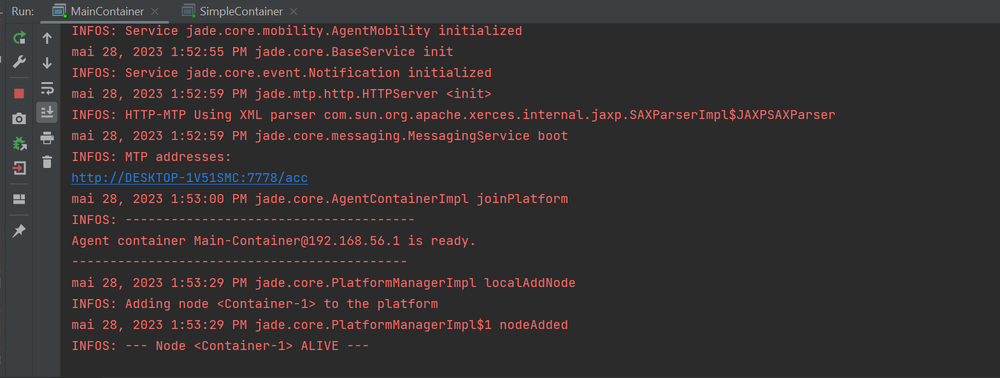

# Distributed implementation of genetic algorithm with island model
## Algorithme génétique parallèle
> L'algorithme génétique parallèle est une approche qui utilise plusieurs algorithmes génétiques pour résoudre une même tâche .
> Chacun de ces algorithmes tente de résoudre la tâche de manière indépendante et une fois leur travail terminé, le meilleur individu de chaque algorithme est sélectionné. Parmi ces meilleurs individus, celui qui présente la meilleure performance est choisi comme solution au problème. Cette approche, souvent appelée "modèle d'îlots", est l'une des méthodes les plus populaires pour les algorithmes génétiques parallèles. Elle tire son nom du fait que les populations sont isolées les unes des autres, similairement aux populations d'organismes vivant sur différentes îles.


## Implementation d'Algorithme génétique parallèle avec SMA

L'implémentation distribuée du modèle d'îlots dans un algorithme génétique avec une approche SMA (Système Multi-Agents) peut être réalisée en utilisant une architecture où chaque îlot est représenté par un agent et les interactions entre les îlots sont gérées par des échanges de messages. 
Il existe des étapes à suivre pour le réaliser :
### Les classes d'agents 

Chaque îlot est représenté par un agent qui exécute son propre algorithme génétique localement. Chaque agent possède sa propre population d'individus et effectue les opérations de sélection, croisement et mutation sur sa population.
On a aussi une classe de master agent qui va recu les reponses des agents et l'afficher.

### Initialisation des agents

Au début, chaque agent est initialisé avec une population de départ, avec des alphabets aléatoires.

### Évolution des agents

Chaque agent fait évoluer sa population en exécutant les opérations génétiques. Les étapes typiques de l'algorithme génétique, telles que la sélection des parents, le croisement des individus sélectionnés et la mutation, sont effectuées localement dans chaque agent.

### Échange d'individus 

Périodiquement, les agents échangent des individus pour promouvoir la diversité et le partage d'informations. L'échange peut être effectué de différentes manières, telles que l'envoi d'un certain nombre d'individus élites de chaque agent aux agents voisins, ou en utilisant des méthodes plus sophistiquées basées sur la similarité ou la distance génétique entre les individus.

### Communication entre agents

Les agents communiquent avec l'agent master en échangeant des messages sur la meilleure population. Chaque agent peut envoyer un message contenant des informations sur les individus sélectionnés pour l'échange, les meilleurs individus trouvés localement pour vers la fin en voie quel agent trouver la chaine de character (le but = "bonjour bdcc").

### Synchronisation et itérations : 

Les agents évoluent de manière asynchrone jusqu'à ce qu'une condition d'arrêt soit satisfaite, telle qu'un nombre maximum d'itérations ou l'obtention d'une solution satisfaisante. À chaque itération, les agents échangent des individus et communiquent pour favoriser l'échange d'informations.


Et pour faire implementation de cet algo, on va utiliser le framework d'agent JADE(Java agent Development Framework) pour faciliter implementation de l'approche SMA.


## Implementation d'algo 

### Definition des agents 

#### IslandAgent

La classe représentant un agent, qui contient sa population d'individus et les opérations génétiques.

```java
public class IslandAgent extends Agent {

    private Individual[] population=new Individual[GAUtils.POPULATION_SIZE];
    private Individual individual1;
    public Individual individual2;

    @Override
    protected void setup() {
        SequentialBehaviour sequentialBehaviour = new SequentialBehaviour();
        sequentialBehaviour.addSubBehaviour(new OneShotBehaviour() {
           @Override
           public void action() {
               initialize();
               sortPopulation();
           }
        });
        sequentialBehaviour.addSubBehaviour(new Behaviour() {
            int iter=0;
            @Override
            public void action() {
                crossover();
                mutation();
                sortPopulation();
                iter++;
            }

            @Override
            public boolean done() {

                return GAUtils.MAX_ITERATIONS<=iter || getBestFintness() == GAUtils.CHROMOSOME_SIZE;
            }
        });
        sequentialBehaviour.addSubBehaviour(new OneShotBehaviour(){

            @Override
            public void action() {
                DFAgentDescription dfAgentDescription = new DFAgentDescription();
                ServiceDescription serviceDescription= new ServiceDescription();
                serviceDescription.setType("ga");
                dfAgentDescription.addServices(serviceDescription);
                DFAgentDescription[] dfAgentDescriptions = null;
                try {
                    dfAgentDescriptions=DFService.search(getAgent(),dfAgentDescription);
                }
               catch (FIPAException e){
                    e.printStackTrace();
               }
                ACLMessage aclMessage = new ACLMessage(ACLMessage.INFORM);
                aclMessage.addReceiver(dfAgentDescriptions[0].getName());
                aclMessage.setContent(Arrays.toString(population[0].getChromosome())+ " : "+ String.valueOf(population[0].getFitness()));
                send(aclMessage);
            }
        });
        addBehaviour(sequentialBehaviour);
    }

    @Override
    protected void takeDown() {
        try {
            DFService.deregister(this);
        } catch (FIPAException e) {
            throw new RuntimeException(e);
        }
    }
        public void initialize(){
            for (int i=0;i<GAUtils.POPULATION_SIZE;i++) {
                population[i]=new Individual();
                population[i].calculateFintess();
            }
        }

        public void crossover(){
            individual1=new Individual(population[0].getChromosome());
            individual2=new Individual(population[1].getChromosome());

            Random random=new Random();
            int crossPoint=random.nextInt(GAUtils.CHROMOSOME_SIZE-1);
            crossPoint++;
            for (int i = 0; i <crossPoint ; i++) {
                individual1.getChromosome()[i]=population[1].getChromosome()[i];
                individual2.getChromosome()[i]=population[0].getChromosome()[i];
            }

        }
        public void showPopulation(){
            for (Individual individual:population) {
                System.out.println(Arrays.toString(individual.getChromosome())+" = "+individual.getFitness());
            }
        }
        public void sortPopulation(){
            Arrays.sort(population, Comparator.reverseOrder());
        }
        public void mutation(){
            Random random=new Random();
            // individual1
            if(random.nextDouble()>GAUtils.MUTATION_PROP){
                int index = random.nextInt(GAUtils.CHROMOSOME_SIZE);
                individual1.getChromosome()[index]=GAUtils.lettre.charAt(random.nextInt(GAUtils.lettre.length()));
            }
            // individual2
            if(random.nextDouble()>GAUtils.MUTATION_PROP){
                int index = random.nextInt(GAUtils.CHROMOSOME_SIZE);
                individual2.getChromosome()[index]=GAUtils.lettre.charAt(random.nextInt(GAUtils.lettre.length()));
            }
            individual1.calculateFintess();
            individual2.calculateFintess();
            population[GAUtils.POPULATION_SIZE-2]=individual1;
            population[GAUtils.POPULATION_SIZE-1]=individual2;


        }
        public int getBestFintness(){
            return population[0].getFitness();
        }

        public Individual[] getPopulation() {
            return population;
        }

        public void setPopulation(Individual[] population) {
            this.population = population;
        }
}
```
### MasterAgent

La classe qui va recoit les populations selectionner.

```java
public class MasterAgent extends Agent {
    @Override
    protected void setup() {
        DFAgentDescription dfAgentDescription = new DFAgentDescription();
        dfAgentDescription.setName(getAID());
        ServiceDescription serviceDescription = new ServiceDescription();
        serviceDescription.setName("master");
        serviceDescription.setType("ga");
        dfAgentDescription.addServices(serviceDescription);

        try{
            DFService.register(this,dfAgentDescription);
        }
        catch (FIPAException e){
            e.printStackTrace();
        }
        addBehaviour(new CyclicBehaviour() {
            @Override
            public void action() {
                ACLMessage receive = receive();
                if(receive!=null){
                    System.out.println(receive.getSender()+" -> "+receive.getContent());
                }
                else {
                    block();
                }

            }
        });
    }
}
```

### MainContainer

La classe principale qui coordonne les interactions entre les agents.

```java
public class MainContainer {

    public static void main(String[] args) throws ControllerException {
        Runtime runtime = Runtime.instance();
        ProfileImpl profile = new ProfileImpl();
        profile.setParameter(Profile.GUI,"true");
        AgentContainer mainContainer = runtime.createMainContainer(profile);
        mainContainer.start();
    }
}
```

### SimpleContainer

la classe qui va lancer le master et l'agent 

```java
public class SimpleContainer {
    public static void main(String[] args)  throws Exception{
        Runtime runtime= Runtime.instance();
        ProfileImpl profile = new ProfileImpl();
        profile.setParameter(profile.MAIN_HOST,"localhost");
        AgentContainer agentContainer =runtime.createAgentContainer(profile);
        AgentController masterAgent=agentContainer.createNewAgent("master",MasterAgent.class.getName(),new Object[]{});
        masterAgent.start();

        for (int i=0;i< GAUtils.ISLAND_NUMBER;i++){
            AgentController islandAgent = agentContainer.createNewAgent("IslandAgent"+i, IslandAgent.class.getName(),new Object[]{});
            islandAgent.start();
        }
    }
}
```


### GAUtils

GAUtils est un ensemble d'utilitaires qui simplifient le développement d'algorithmes génétiques en fournissant des fonctionnalités génériques et réutilisables pour les opérations courantes liées aux génétiques, facilitant ainsi l'implémentation et l'expérimentation des algorithmes génétiques.

```java
public class GAUtils {
    public static final int CHROMOSOME_SIZE=12;
    public static final String but="bonjour bdcc";
    public static final int POPULATION_SIZE=20;
    public static final double MUTATION_PROP=0.5;
    public static final int MAX_ITERATIONS=50;

    public static final String lettre="abcdefghijklmopqrstuvwxyz ABCDEFGHIJKLMNOPARSTUVWXYZ";

    public static final  int ISLAND_NUMBER=5;
}
```

## Execution 

- ```MainContiner```



- ``` Master et Island```


- ```SimpleContainer```

``` commandline
"C:\Program Files\Java\jdk1.8.0_202\bin\java.exe" "-javaagent:C:\Program Files\JetBrains\IntelliJ IDEA 2022.2.2\lib\idea_rt.jar=65317:C:\Program Files\JetBrains\IntelliJ IDEA 2022.2.2\bin" -Dfile.encoding=UTF-8 -classpath "C:\Program Files\Java\jdk1.8.0_202\jre\lib\charsets.jar;C:\Program Files\Java\jdk1.8.0_202\jre\lib\deploy.jar;C:\Program Files\Java\jdk1.8.0_202\jre\lib\ext\access-bridge-64.jar;C:\Program Files\Java\jdk1.8.0_202\jre\lib\ext\cldrdata.jar;C:\Program Files\Java\jdk1.8.0_202\jre\lib\ext\dnsns.jar;C:\Program Files\Java\jdk1.8.0_202\jre\lib\ext\jaccess.jar;C:\Program Files\Java\jdk1.8.0_202\jre\lib\ext\jfxrt.jar;C:\Program Files\Java\jdk1.8.0_202\jre\lib\ext\localedata.jar;C:\Program Files\Java\jdk1.8.0_202\jre\lib\ext\nashorn.jar;C:\Program Files\Java\jdk1.8.0_202\jre\lib\ext\sunec.jar;C:\Program Files\Java\jdk1.8.0_202\jre\lib\ext\sunjce_provider.jar;C:\Program Files\Java\jdk1.8.0_202\jre\lib\ext\sunmscapi.jar;C:\Program Files\Java\jdk1.8.0_202\jre\lib\ext\sunpkcs11.jar;C:\Program Files\Java\jdk1.8.0_202\jre\lib\ext\zipfs.jar;C:\Program Files\Java\jdk1.8.0_202\jre\lib\javaws.jar;C:\Program Files\Java\jdk1.8.0_202\jre\lib\jce.jar;C:\Program Files\Java\jdk1.8.0_202\jre\lib\jfr.jar;C:\Program Files\Java\jdk1.8.0_202\jre\lib\jfxswt.jar;C:\Program Files\Java\jdk1.8.0_202\jre\lib\jsse.jar;C:\Program Files\Java\jdk1.8.0_202\jre\lib\management-agent.jar;C:\Program Files\Java\jdk1.8.0_202\jre\lib\plugin.jar;C:\Program Files\Java\jdk1.8.0_202\jre\lib\resources.jar;C:\Program Files\Java\jdk1.8.0_202\jre\lib\rt.jar;C:\Users\a.DESKTOP-1V51SMC\OneDrive\Documents\GitHub\SMA_IA\TP_GA_SMA\out\production\TP_GA_SMA;C:\Users\a.DESKTOP-1V51SMC\OneDrive\Documents\GitHub\SMA_IA\TP_GA_SMA\jade.jar" ma.enset.bddc.sequenciel.SimpleContainer
mai 28, 2023 1:53:27 PM jade.core.Runtime beginContainer
INFOS: ----------------------------------
    This is JADE 4.6.0 - revision 6869 of 30-11-2022 14:47:03
    downloaded in Open Source, under LGPL restrictions,
    at http://jade.tilab.com/
----------------------------------------
mai 28, 2023 1:53:29 PM jade.imtp.leap.LEAPIMTPManager initialize
INFOS: Listening for intra-platform commands on address:
- jicp://192.168.56.1:65322

mai 28, 2023 1:53:29 PM jade.core.BaseService init
INFOS: Service jade.core.management.AgentManagement initialized
mai 28, 2023 1:53:29 PM jade.core.BaseService init
INFOS: Service jade.core.messaging.Messaging initialized
mai 28, 2023 1:53:29 PM jade.core.BaseService init
INFOS: Service jade.core.resource.ResourceManagement initialized
mai 28, 2023 1:53:29 PM jade.core.BaseService init
INFOS: Service jade.core.mobility.AgentMobility initialized
mai 28, 2023 1:53:29 PM jade.core.BaseService init
INFOS: Service jade.core.event.Notification initialized
mai 28, 2023 1:53:29 PM jade.core.AgentContainerImpl joinPlatform
INFOS: --------------------------------------
Agent container Container-1@192.168.56.1 is ready.
--------------------------------------------
( agent-identifier :name IslandAgent0@192.168.56.1:1099/JADE  :addresses (sequence http://DESKTOP-1V51SMC:7778/acc )) -> [Z, K, V, j, t, F, X,  , R, F, c, V] : 3
( agent-identifier :name IslandAgent4@192.168.56.1:1099/JADE  :addresses (sequence http://DESKTOP-1V51SMC:7778/acc )) -> [i, o, j, P, A, A, P, B, p, d, T, A] : 2
( agent-identifier :name IslandAgent2@192.168.56.1:1099/JADE  :addresses (sequence http://DESKTOP-1V51SMC:7778/acc )) -> [b, M, Y, b, M, J, y, k, m, H, K, U] : 1
( agent-identifier :name IslandAgent3@192.168.56.1:1099/JADE  :addresses (sequence http://DESKTOP-1V51SMC:7778/acc )) -> [b, e, F, f, s, b, f, J, t, d, b, R] : 2
( agent-identifier :name IslandAgent1@192.168.56.1:1099/JADE  :addresses (sequence http://DESKTOP-1V51SMC:7778/acc )) -> [p, Z, F, G, o, J, v, J, b, f, G, K] : 2

```
